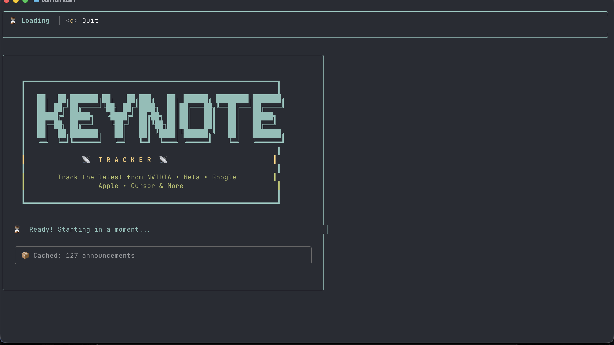

# 📡 Keynote Tracker

A modern, interactive CLI tool to track the latest announcements from major tech keynotes and events. Built with Bun and Ink for a beautiful terminal experience.



## ✨ Features

- 🎨 **ASCII Art Banner** - Eye-catching startup screen with branded ASCII art
- 🎛️ **Multi-Pane Layout** - Miller Columns-style interface (like macOS Finder)
- 🎯 **Interactive UI** - Modern, responsive interface using Ink
- 🔄 **Auto-refresh** - Smart caching with automatic updates
- 📰 **Multiple Sources** - Track NVIDIA, Meta, Google, Apple, Cursor, and more
- 💾 **Local Storage** - Persistent data with historical announcements
- ⚡ **Fast** - Powered by Bun runtime for blazing-fast performance
- 🎨 **Beautiful Output** - Colored, formatted display with proper spacing
- 📱 **Keyboard Navigation** - Intuitive arrow key and Tab navigation
- 👁️ **Context Preservation** - See sources, lists, and details simultaneously
- 📦 **Standalone Builds** - Compile to native executables for easy distribution

## 🎯 Supported Sources

All sources are now fully configurable via YAML! Default sources include:

- **NVIDIA** - NVIDIA Blog and Developer News
- **Meta** - Meta Newsroom and Engineering Blog
- **Google** - Google Blog and Android Developers
- **Apple** - Apple Newsroom and Developer News (including WWDC)
- **Cursor** - Cursor IDE Releases and Updates

**Add your own sources** by editing `~/.config/keynote-tracker/sources.yaml`!

## 📋 Prerequisites

- [Bun](https://bun.sh) runtime installed (v1.0.0 or higher)

### Installing Bun

```bash
# macOS and Linux
curl -fsSL https://bun.sh/install | bash

# Windows (WSL required)
curl -fsSL https://bun.sh/install | bash
```

## 🚀 Installation

1. Clone or download the project:

```bash
cd keynote-tracker
```

2. Install dependencies:

```bash
bun install
```

3. Make the CLI executable:

```bash
chmod +x src/index.js
```

4. (Optional) Link globally:

```bash
bun link
```

Now you can run `keynote-tracker` from anywhere!

## 💻 Usage

### Interactive Mode (Default)

Launch the interactive interface:

```bash
bun run start
# or if linked globally:
keynote-tracker
```

### Force Refresh

Force refresh all sources before displaying:

```bash
bun run start refresh
# or:
keynote-tracker refresh
```

### List Specific Source

View announcements from a specific source:

```bash
bun run start list nvidia
# or:
keynote-tracker list apple
# or shorthand:
keynote-tracker google
```

### Help

Display help information:

```bash
keynote-tracker help
# or:
keynote-tracker --help
```

## ⌨️ Keyboard Shortcuts

| Key | Action |
|-----|--------|
| `Tab` | Switch to next pane |
| `Shift+Tab` | Switch to previous pane |
| `↑/↓` | Navigate through items in active pane |
| `Enter` | Select an item |
| `ESC` | Close rightmost pane / go back |
| `Ctrl+C` | Exit the application |

**📖 For detailed multi-pane navigation guide, see [MULTI_PANE_GUIDE.md](MULTI_PANE_GUIDE.md)**

## 📖 How It Works

1. **First Launch**: The tool fetches announcements from all sources
2. **Caching**: Data is cached locally in `data/announcements.json`
3. **Smart Refresh**: Automatically refreshes if data is older than 24 hours
4. **Multi-Pane Navigation**: 
   - **Pane 1**: Source selector (always visible)
   - **Pane 2**: Announcement list (opens when source selected)
   - **Pane 3**: Full details (opens when announcement selected)
   - Navigate with Tab, select with Enter, go back with ESC
5. **Historical Data**: All fetched announcements are preserved for future viewing

### Interface Preview

```
┌─────────────────┬─────────────────┬─────────────────┐
│  Sources        │  Announcements  │  Details        │
├─────────────────┼─────────────────┼─────────────────┤
│ 🔄 Refresh All  │ 📰 NVIDIA       │ 📄 Details      │
│ ─────────────── │ ───────────     │ ─────────       │
│ ▶ NVIDIA        │ ▶ Article 1     │ Title: ...      │
│   Meta          │   Article 2     │ Date: ...       │
│   Google        │   Article 3     │ Content: ...    │
│   Apple         │   ...           │ ...             │
│   Cursor        │                 │                 │
└─────────────────┴─────────────────┴─────────────────┘
```

## 🗂️ Project Structure

```
keynote-tracker/
├── src/
│   ├── index.js                 # CLI entry point
│   ├── components/              # Ink UI components
│   │   ├── App.jsx
│   │   ├── EventSelector.jsx
│   │   ├── AnnouncementList.jsx
│   │   ├── AnnouncementDetail.jsx
│   │   ├── HeaderBar.jsx
│   │   └── TableView.jsx
│   ├── services/                # Business logic
│   │   ├── dataFetcher.js       # Dynamic source loading
│   │   ├── configManager.js     # YAML configuration loader
│   │   ├── fetcherFactory.js    # Dynamic fetcher generation
│   │   └── storage.js           # Data persistence
│   ├── config/
│   │   └── sources.default.yaml # Default sources configuration
│   └── utils/                   # Utilities
│       ├── cache.js
│       └── dateFormatter.js
├── data/
│   └── announcements.json       # Cached data
├── package.json
├── bunfig.toml
└── README.md

User Configuration:
~/.config/keynote-tracker/
└── sources.yaml                 # User's custom sources
```

## 🔧 Configuration

### Sources Configuration

All sources are configured via YAML at `~/.config/keynote-tracker/sources.yaml`.

On first run, the tool automatically creates this file with default sources. You can edit it to:
- Add new sources (RSS feeds, GitHub repos, custom APIs)
- Remove sources you don't need
- Modify existing sources (change URLs, limits, categories)
- Customize field mappings and parsing logic

To view your configuration file location:
```bash
keynote-tracker help
```

### Other Configuration

- **Cache Duration**: Edit `CACHE_DURATION` in `src/utils/cache.js`
- **Display Limits**: Adjust `limit` values in your `sources.yaml`

## 🌐 Data Sources

The tool fetches from official RSS feeds and APIs:

- **NVIDIA**: RSS from blogs.nvidia.com and developer.nvidia.com
- **Meta**: RSS from about.fb.com and engineering.fb.com
- **Google**: RSS from blog.google and Android Developers
- **Apple**: RSS from apple.com/newsroom and developer.apple.com
- **Cursor**: GitHub Releases API

## 🐛 Troubleshooting

### No announcements appearing

1. Check your internet connection
2. Try force refresh: `keynote-tracker refresh`
3. Check if RSS feeds are accessible

### Permission denied

Make sure the script is executable:

```bash
chmod +x src/index.js
```

### Bun not found

Install Bun runtime:

```bash
curl -fsSL https://bun.sh/install | bash
```

### Dependencies not installing

Clear cache and reinstall:

```bash
rm -rf node_modules
bun install
```

## 🤝 Contributing

Contributions are welcome! Here are some ways to contribute:

- Add new sources (e.g., Microsoft, OpenAI, AWS)
- Improve error handling
- Add filtering and search features
- Enhance UI/UX
- Fix bugs

## 📝 Adding New Sources

Adding new sources is easy - just edit your `~/.config/keynote-tracker/sources.yaml` file!

### Source Types

The tool supports three types of sources:

#### 1. RSS Feeds

Most common type for blogs and news sites:

```yaml
sources:
  microsoft:
    name: "Microsoft"
    description: "Microsoft Blog"
    feeds:
      - type: rss
        url: "https://blogs.microsoft.com/feed/"
        category: "blog"
        limit: 20
        fields:
          title: "title"
          date: "pubDate"
          description: "contentSnippet"
          content: "content"
          link: "link"
          tags: "categories"
```

#### 2. GitHub Releases

Track software releases from GitHub repositories:

```yaml
sources:
  vscode:
    name: "VS Code"
    description: "Visual Studio Code Releases"
    feeds:
      - type: github
        repo: "microsoft/vscode"
        category: "release"
        limit: 15
        fields:
          title: "name"
          titleFallback: "tag_name"
          date: "published_at"
          description: "body"
          link: "html_url"
        tagLogic: "prerelease ? ['prerelease'] : ['release']"
```

#### 3. Custom API Endpoints

For custom data sources with transformation logic:

```yaml
sources:
  custom:
    name: "Custom API"
    description: "Custom data source"
    feeds:
      - type: api
        url: "https://api.example.com/news"
        method: "GET"
        headers:
          User-Agent: "keynote-tracker"
          Authorization: "Bearer YOUR_TOKEN"
        timeout: 10000
        limit: 20
        transform: |
          return data.items.map(item => ({
            title: item.headline,
            date: item.timestamp,
            description: item.summary,
            content: item.body,
            link: item.url,
            category: item.type,
            tags: item.keywords || []
          }));
```

### Multiple Feeds Per Source

You can combine multiple feeds under one source:

```yaml
sources:
  aws:
    name: "AWS"
    description: "Amazon Web Services News"
    feeds:
      - type: rss
        url: "https://aws.amazon.com/blogs/aws/feed/"
        category: "blog"
        limit: 20
      - type: rss
        url: "https://aws.amazon.com/blogs/developer/feed/"
        category: "developer"
        limit: 15
```

### Field Mappings

Customize how data is extracted from feeds:

```yaml
fields:
  title: "title"              # Primary field
  titleFallback: "tag_name"   # Fallback if primary is missing
  date: "pubDate"
  dateFallback: "isoDate"
  description: "contentSnippet"
  content: "content:encoded"   # Can use special fields
  contentFallback: "content"
  link: "link"
  tags: "categories"
```

### Complete Example

Here's a complete example adding multiple new sources:

```yaml
sources:
  # ... existing sources (nvidia, meta, google, apple, cursor)
  
  openai:
    name: "OpenAI"
    description: "OpenAI Research and Updates"
    feeds:
      - type: rss
        url: "https://openai.com/blog/rss.xml"
        category: "blog"
        limit: 20
        fields:
          title: "title"
          date: "pubDate"
          description: "contentSnippet"
          content: "content"
          link: "link"
          tags: "categories"
  
  anthropic:
    name: "Anthropic"
    description: "Anthropic Research"
    feeds:
      - type: github
        repo: "anthropics/anthropic-sdk-python"
        category: "release"
        limit: 10
  
  hackernews:
    name: "Hacker News"
    description: "Top Stories from Hacker News"
    feeds:
      - type: api
        url: "https://hacker-news.firebaseio.com/v0/topstories.json"
        method: "GET"
        limit: 10
        transform: |
          // Fetch top 10 story IDs and get their details
          const storyIds = data.slice(0, 10);
          const stories = [];
          // Note: This is a simplified example
          // In practice, you'd need to fetch each story's details
          return stories;
```

### After Adding Sources

After editing `sources.yaml`:

1. Save the file
2. Run `keynote-tracker refresh` to fetch from new sources
3. Your new sources will appear in the source selector

### Validation

The tool validates your configuration on startup. If there are errors:
- Check the error message for details
- Ensure all required fields are present
- Verify YAML syntax is correct
- Make sure URLs are accessible

## 📜 License

MIT License - feel free to use this project for personal or commercial purposes.

## 🙏 Acknowledgments

- Built with [Ink](https://github.com/vadimdemedes/ink) - React for CLI
- Powered by [Bun](https://bun.sh) - Fast JavaScript runtime
- RSS parsing by [rss-parser](https://github.com/rbren/rss-parser)

## 📞 Support

If you encounter any issues or have questions:

1. Check the troubleshooting section
2. Review existing issues on GitHub
3. Create a new issue with details about your problem

---

**Happy tracking! 📡**

